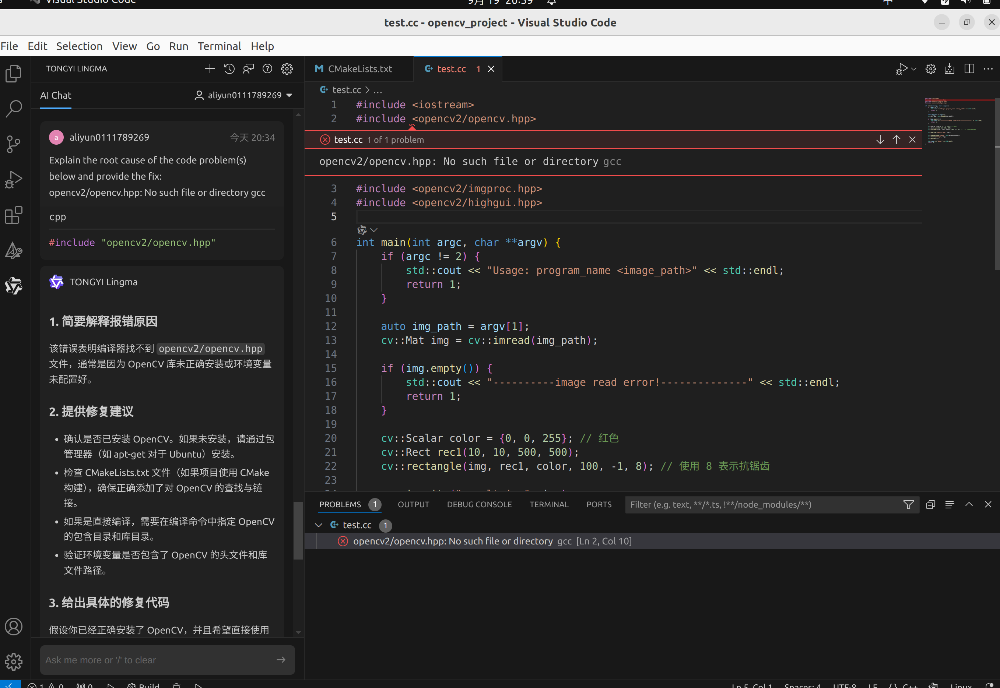
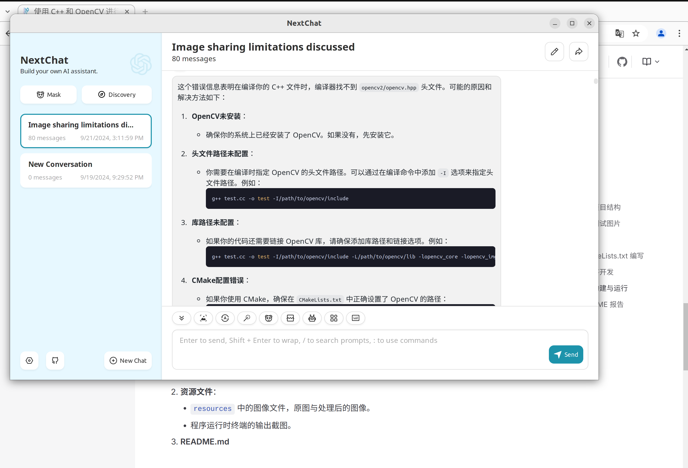
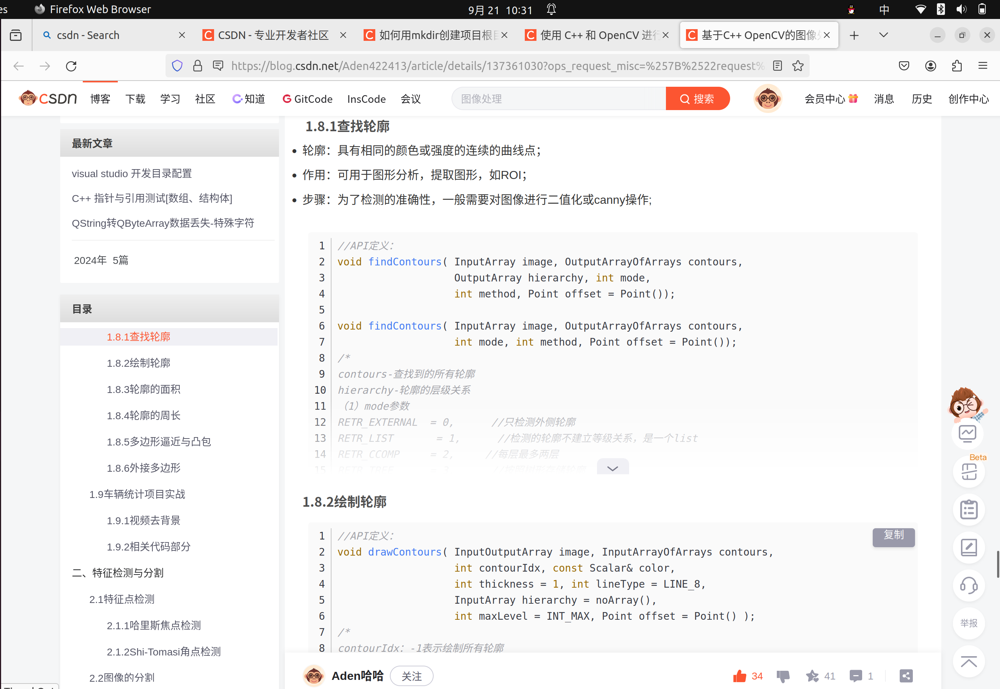
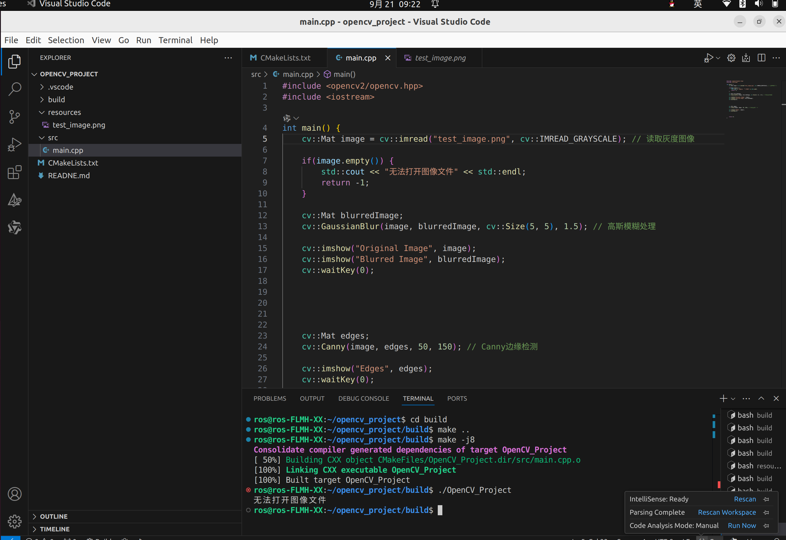
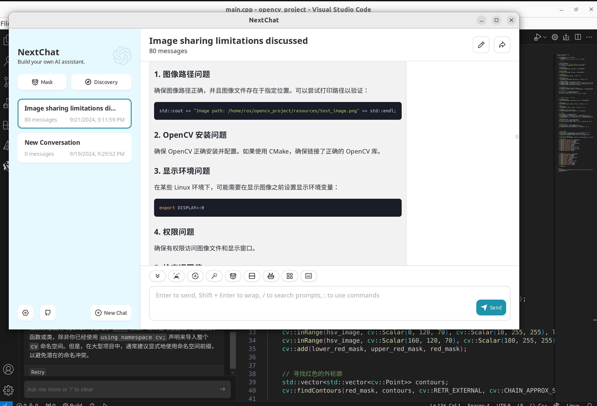
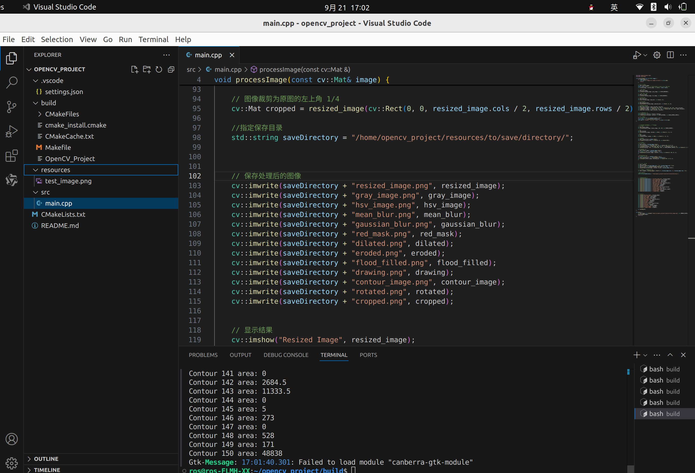

# 一、csdn搜索C++环境配置方法，过程顺利
# 二、安装opencv库
## 1.开始用APT安装opencv库
### 问题：vscode中找不到opencv库，询问gpt,在CmakeLists.txt中添加opencv库的搜索路径，并重新编译项目。尝试几次后重启才成功。

=======

=======
#### 
#### 

## 2.后来任务完成后，又删掉安装好的opencv库，重新用编译的方法安装opencv库。
### 问题：编译opencv的时候卡了，重新编译后才成功，时间比较漫长。
# 三、组织项目结构，过程顺利。
# 四、实现基础图像处理操作
## 在csdn和gpt中查看相关代码，在b站等平台学习opencv图像处理（学习过程中）
#### 
### 1.问题：修改某些代码后，最后图片无法显示，求助gpt，通过检查图片路径，opencv安装问题，以及代码编写问题成功解决。
#### 
#### 
### 2.问题：图片保存不到对应文件夹，路径有问题，与文件夹大小写，用户名的添加有关。

=======
#### 

### 3.图片过大，不能完整展现。通过gpt查看相关代码，实现图片缩小。

